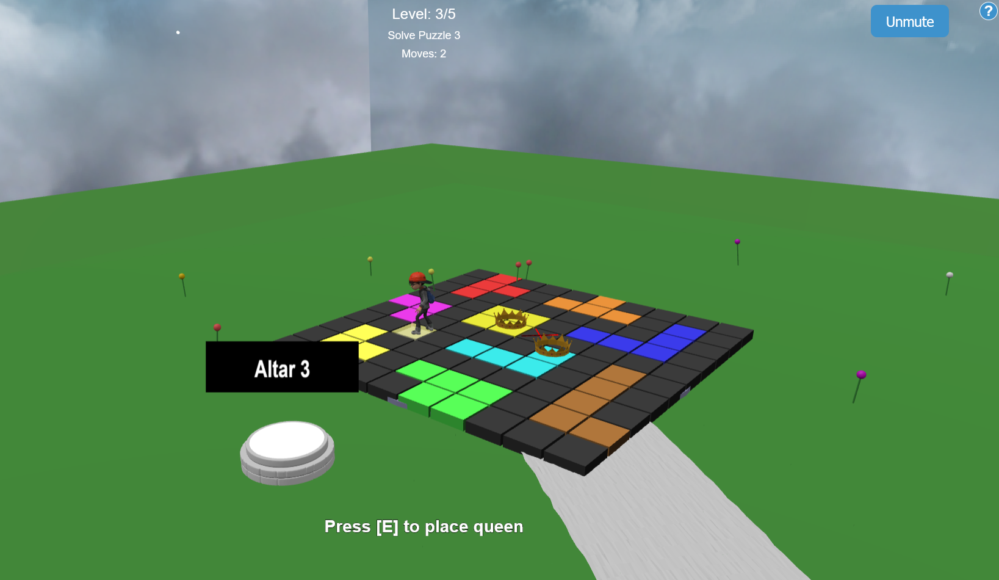

# Astral Queens

A 3D puzzle game built with BabylonJS and TypeScript featuring dynamic level loading, immersive lighting effects, and strategic queen placement puzzles in a beautifully crafted floating island environment.



## 🎮 Live Demo
**Play Online**: [https://yisola2.github.io/Astral_Queens_GOW2025/](https://yisola2.github.io/Astral_Queens_GOW2025/)

## 📺 Demo Video

**YouTube Gameplay**: [Check it here] (https://youtu.be/wt8TXjbOlls)

**Dark Level**: [Check it here] (https://youtu.be/El8_Y1qvPKc)

## 📸 Photo Gallery

**Screenshots & Media**: [Check it here] (https://www.dropbox.com/scl/fi/ndni1eam1iangnm6h3v4c/Capture-d-cran-2025-03-31-104229.png?rlkey=mvtseke56pvw1dwrsyelee8kb&st=24dpdjzg&dl=0)

---

## 🌟 Game Description

Astral Queens is a 3D puzzle game that combines spatial exploration with logical queen placement puzzles. I created an immersive world where you navigate floating islands and solve increasingly complex puzzles through strategic thinking and spatial reasoning.

### Core Features
- **99+ Dynamic Puzzles**: JSON-loaded levels with varying grid sizes (7x7 to 11x11)
- **3D Environment**: Beautifully designed archipelago with interactive altars
- **Physics-Based Movement**: Realistic character controller with smooth animations
- **Advanced Audio System**: Immersive soundscape with spatial audio effects
- **Progressive Difficulty**: Smart level selection from unsolved puzzles only
- **Visual Feedback**: Real-time validation with color-coded hints

---

## 🎯 Game Objective

Master the art of strategic queen placement by following these rules:
1. **Row/Column/Region**: Each row, column, and colored region must have exactly one queen
2. **No Touching**: Queens cannot be placed adjacent (horizontally, vertically, OR diagonally) to another queen. They cannot touch, even at corners
3. **Perfect Logic**: All puzzles are solvable through pure deduction (no guessing required)

---

## 🎮 Controls

### Character Movement
- **WASD** / **ZQSD**: Move character around the world
- **Mouse** or **Arrow Keys**: Look around and control camera
- **Mouse Wheel**: Zoom in/out during exploration

### Puzzle Interaction
- **E**: Interact with altars / Place queen on highlighted cell
- **R**: Remove queen from highlighted cell
- **SPACE**: Mark/unmark highlighted cell (for planning)

### Interface
- **H** or **?**: Show help screen with scrollable instructions
- **Audio Button**: Mute/unmute game sounds

---

## 🛠️ Technologies Used

- **TypeScript**: Type-safe development with modern ES features
- **BabylonJS**: Industry-standard 3D rendering engine
- **Havok Physics**: Professional physics simulation
- **BabylonJS GUI**: Native 3D user interface system
- **Web Audio API**: High-quality spatial audio via BabylonJS Audio Engine
- **Vite**: Lightning-fast build tool and development server
- **Modern Web Standards**: ES6+, WebGL 2.0, WASM

---

## 📦 Installation

### Prerequisites
- Node.js (v16 or higher)
- npm or yarn package manager

### Quick Start
```bash
# Clone the repository
git clone https://github.com/yisola2/Astral_Queens_GOW2025.git
cd Astral_Queens_GOW2025

# Install dependencies
npm install

# Start development server
npm run dev
```

---

## 📁 Project Structure

```
src/
├── Game.ts              # Main game orchestrator and initialization
├── Environment.ts       # 3D world creation and skybox setup
├── PlayerController.ts  # Character movement and physics
├── GridManager.ts       # Puzzle grid logic and validation
├── AltarManager.ts      # Dynamic altar positioning and level loading
├── UIManager.ts         # User interface and popup management
├── InputManager.ts      # Input handling and key mapping
├── AudioManager.ts      # Comprehensive audio system
└── types.d.ts          # TypeScript definitions

public/
├── levels/
│   └── levels.json     # 99+ puzzle definitions
├── models/             # 3D assets (altars, character, environment)
├── assets/
│   ├── sounds/         # Audio files (music, effects)
│   └── envmap_miramar/ # Skybox textures
└── images/            # UI and promotional images
```

---

## 🎨 Detailed Components

### Audio System (AudioManager.ts)

I implemented a comprehensive audio system with the following capabilities:

- **Audio Engine**: Uses BabylonJS Audio Engine with Web Audio API integration
- **Sound Management**:
  - Background music with streaming support (`theme_1.ogg`)
  - Spatial sound effects for footsteps and interactions (`footstep.wav`, `placeQueen.wav`)
  - Volume control and sound state management
  - Automatic audio context handling and user interaction unlocking

- **Browser Compatibility**:
  - Smart audio unlocking with prominent user interaction prompts
  - Handles autoplay policies across different browsers
  - Multi-format support (OGG, WAV)
  - Performance-optimized streaming for music tracks


### Physics System (PlayerController.ts)

My player movement and collision system uses the Havok Physics engine with these features:

- **Character Controller**: Uses a physics capsule-based character with:
  - Mass: 1 unit with configured restitution (0.1) and friction (0.8)
  - Linear damping: 0.5 to prevent sliding
  - Angular damping: 0.5 to limit rotation
  - Custom inertia settings for realistic movement

- **Movement System**:
  - Camera-relative movement: Player moves in the direction the camera is facing
  - Quaternion-based smooth rotation using SLERP (Spherical Linear Interpolation)
  - Ground contact detection using ray casting from player's feet
  - Walking animation triggered when in motion, idle when stationary

- **Character Model**:
  - 3D character model (`Aj.glb`) loaded via BabylonJS SceneLoader
  - Animation system with idle and walking states
  - Model parented to the physics capsule for proper collision handling
  - Automatic fallback to visible capsule if model loading fails

### Dynamic Level System

I implemented a sophisticated level management system:

- **JSON-Based Levels**: 99+ levels loaded from `public/levels/levels.json`
- **Adaptive Grid Manager**: Supports variable grid sizes (7x7 to 11x11)
- **Smart Color Assignment**: 20 distinct colors for optimal region visibility
- **Progress Tracking**: Local storage persistence for completed levels
- **Random Selection**: Algorithm that picks only from unsolved levels

### Intelligent Altar Positioning

My altar system dynamically adapts to the environment:

- **Platform-Based Placement**: Altars automatically position relative to island platforms
- **Dynamic Mesh Detection**: Uses `IslandPlatform_X` mesh names for precise positioning
- **3D Model Integration**: `altar_beta.glb` models with animated glow rings and particle effects

### Advanced Camera System

I implemented a dual-mode camera system:

- **Exploration Mode**: 
  - ArcRotateCamera with orbital controls
  - Configurable zoom limits (5-30 units)
  - Beta limits to prevent underground viewing
  - Smooth target following for player movement

- **Puzzle Mode**: 
  - Focused overhead view for optimal puzzle solving
  - Automatic transitions between exploration and puzzle focus
  - Camera interpolation for smooth mode switching

### Altar 5: The Darkness Challenge [Check it here] (https://youtu.be/El8_Y1qvPKc)

I created a special level that transforms the gameplay experience:

- **Dynamic Lighting System**: 
  - When activated, dramatically reduces all ambient lighting intensity to 0
  - Removes environment texture for complete darkness
  - Creates a player-attached point light with custom properties:
    - Intensity: 4.0 for adequate visibility
    - Range: 4 units for limited illumination radius
    - Moonlight color tint (0.7, 0.7, 1.0) for atmospheric effect

- **Enhanced Challenge**:
  - Tests spatial memory and planning skills
  - Unique gameplay variation that rewards careful exploration
  - Complete lighting restoration when deactivating the altar

### Environment & 3D World (Environment.ts)

My immersive world features:

- **Skybox System**: 
  - Cube texture implementation using miramar environment maps
  - Seamless 360-degree celestial backdrop

- **3D Model Integration**:
  - Main world model (`astral_queen_v4.glb`) created in Blender with multiple island platforms
  - Physics mesh integration using Blender-exported GrassPlane for accurate collision
  - Automatic static collision for all Blender-created environment meshes

- **Lighting Setup**:
  - Hemispheric ambient light (intensity: 0.5)
  - Directional light for highlights and depth (intensity: 0.8)
  - Hub marker for world center reference

### User Interface (UIManager.ts)

My UI system features a comprehensive layout:

- **Hierarchical Container System**: 
  - Top, bottom, and center areas with responsive design
  - StackPanel organization for clean element arrangement

- **Help System with ScrollViewer**:
  - Scrollable help popup 
  - Modal background that blocks game interaction
  - Comprehensive controls and rules documentation

- **Interactive Elements**:
  - Real-time interaction prompts based on player context
  - Visual feedback for queen placement and removal
  - Audio mute/unmute toggle with persistent state

- **Visual Effects**:
  - Particle systems for puzzle completion celebrations
  - Color-coded cell highlighting and validation feedback
  - Smooth animations and transitions throughout


---

## 🔧 Development Notes

- **Havok Physics**: Requires proper WASM file locations in `public/lib/` directory
- **BabylonJS Scene Management**: Comprehensive scene coordination for all game elements
- **Audio System**: Requires BabylonJS engine initialization with `{ audioEngine: true }` option


---

## 👨‍💻 Author

**Yassin Es Saim**

---

## 🙏 Acknowledgments

- BabylonJS community for excellent documentation and support
- Havok Physics for providing robust physics simulation
- Open source community for inspiration and development tools
- Beta testers for valuable feedback and bug reports

---


